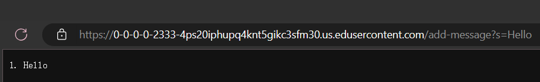

# LabReport2
Servers and SSH Keys

# Part 1 
Show the code for your `StringServer`, and two screenshots of using `/add-message`.
The code:
```
import java.io.IOException;
import java.net.URI;

class StringHandler implements URLHandler{
    int x = 0;
    String messages = "";
    public String handleRequest(URI url){
        if (url.getPath().equals("/")) {
            return String.format("%s", messages);
        } 
        else{
            if (url.getPath().contains("/add-message")) {
                String[] parameters = url.getQuery().split("=");
                if (parameters[0].equals("s")) {
                        x++;
                        messages += x + ". "+parameters[1] + "\n";
                    }
                    return String.format("%s", messages);
                }
            }
            return "404 Not Found!";
        }

    }

class StringServer {
    public static void main(String[] args) throws IOException{
        if(args.length == 0){
            System.out.println("Missing port number! Try any number between 1024 to 49151");
            return;
        }

        int port = Integer.parseInt(args[0]);

        Server.start(port, new StringHandler());
    }
}
```

For each of the two screenshots, describe:
- Which methods in your code are called?
- What are the relevant arguments to those methods, and the values of any relevant class fields?
- How do the values of any relevant fields of the class change from this specific request? If no values got changed, explain why.

## First screenshot
using `add-message?s=Hello`


- The method is called: `public String handleRequest(URI url)`.
  ```
  public String handleRequest(URI url){
        if (url.getPath().equals("/")) {
            return String.format("%s", messages);
        } 
        else{
            if (url.getPath().contains("/add-message")) {
                String[] parameters = url.getQuery().split("=");
                if (parameters[0].equals("s")) {
                        x++;
                        messages += x + ". "+parameters[1] + "\n";
                    }
                    return String.format("%s", messages);
                }
            }
            return "404 Not Found!";
        }
  ```
- The relevant argument is the URL that is passed through in the method, which in this case is `https://0-0-0-0-2333-4ps20iphupq4knt5gikc3sfm30.us.edusercontent.com/add-message?s=Hello`. The values that are used from the class are `int x`, and `String messages`
- The values that changed are `int x` and `String messages`.  `int x` increased from 0 to 1, by `x++;`. And `String messages` changed from `""` to `"1. Hello"`, by `messages += x + ". "+parameters[1] + "\n";`. 
  The reason that they changed is that the method gets the URL and finds the path `/add-messages`, adds the string that is typed in with `parameter [1]` adds it into messages, and increases the number in front by 1.

## Second screenshot
using `add-message?s=Hello`

- The method is called: `public String handleRequest(URI url)`.
  ```
  public String handleRequest(URI url){
        if (url.getPath().equals("/")) {
            return String.format("%s", messages);
        } 
        else{
            if (url.getPath().contains("/add-message")) {
                String[] parameters = url.getQuery().split("=");
                if (parameters[0].equals("s")) {
                        x++;
                        messages += x + ". "+parameters[1] + "\n";
                    }
                    return String.format("%s", messages);
                }
            }
            return "404 Not Found!";
        }
  ```
- The relevant argument is the URL that is passed through in the method, which in this case is `https://0-0-0-0-2333-4ps20iphupq4knt5gikc3sfm30.us.edusercontent.com/add-message?s=How%20are%20you`. The values that are used from the class are `int x`, and `String messages`
- The changed values are `int x` and `String messages`. `int x` increase from 1 to 2, by `x++;`. And `String messages` changed from `"1. Hello"` to `"1. Hello\n 2. How+are+you"`, by `messages += x + ". "+parameters[1] + "\n";`. 
  The reason that they changed is the same as screenshot 1.

# Part 2
Using the command line, show with `ls` and take screenshots of:
1. The path to the private key for your SSH key for logging into ieng6 (on your computer or on the home directory of the lab computer)
2. The path to the public key for your SSH key for logging into ieng6 (within your account on ieng6)
3. A terminal interaction where you log into ieng6 with your course-specific account without being asked for a password.

## The path to the private key for your SSH key for logging into ieng6 (on your computer or on the home directory of the lab computer)：


## The path to the public key for your SSH key for logging into ieng6 (within your account on ieng6):


## A terminal interaction where you log into ieng6 with your course-specific account without being asked for a password.


# Part 3
- In a couple of sentences, describe something you learned from lab in week 2 or 3 that you didn’t know before.
I learned that we can use ssh to log into a remote server. I learned that we can use `curl` to access web pages in the terminal. Something I think is interesting is that I can create access keys on the remote server using `scp` and not need to use the password anymore when logging into the remote server. I also learned that we can use `man` to see the manual on the terminal of any command that we are unfamiliar with. 
