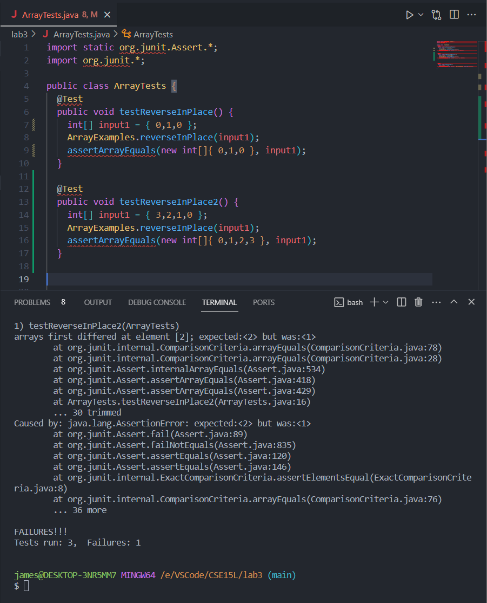

# Lab Report3
Bugs and Commands

# Part 1 - Bugs
Provide:
- A failure-inducing input for the buggy program, as a JUnit test and any associated code (write it as a code block in Markdown)
- An input that doesn’t induce a failure, as a JUnit test and any associated code (write it as a code block in Markdown)
- The symptom, as the output of running the tests (provide it as a screenshot of running JUnit with at least the two inputs above)
- The bug, as the before-and-after code change required to fix it (as two code blocks in Markdown)
Briefly describe why the fix addresses the issue.

1. A failure-inducing input for the buggy program, as a JUnit test and any associated code (write it as a code block in Markdown)
JUnit Test:
```
@Test
  public void testReverseInPlace2() {
    int[] input1 = { 3,2,1,0 };
    ArrayExamples.reverseInPlace(input1);
    assertArrayEquals(new int[]{ 0,1,2,3 }, input1);
	}
```
Associated code:
```
static void reverseInPlace(int[] arr) {
    for(int i = 0; i < arr.length; i += 1) {
      arr[i] = arr[arr.length - i - 1];
    }
  }
```
2. An input that doesn’t induce a failure, as a JUnit test and any associated code (write it as a code block in Markdown)
JUnit Test:
```
@Test 
	public void testReverseInPlace() {
    int[] input1 = { 0,1,0 };
    ArrayExamples.reverseInPlace(input1);
    assertArrayEquals(new int[]{ 0,1,0 }, input1);
	}

```
Associated code:
```
static void reverseInPlace(int[] arr) {
    for(int i = 0; i < arr.length; i += 1) {
      arr[i] = arr[arr.length - i - 1];
    }
  }
```
3. Screenshot for the Symptom
   


5. The Bug, as the before-and-after code change required to fix it (as two code blocks in Markdown)
Before Code:
```
static void reverseInPlace(int[] arr) {
    for(int i = 0; i < arr.length; i += 1) {
      arr[i] = arr[arr.length - i - 1];
    }
  }
```
After Code:
```
  static void reverseInPlace(int[] arr) {
    int[] temp = arr.clone();
    for(int i = 0; i < arr.length; i += 1) {
      arr[i] = temp[arr.length - i - 1];
    }
  }
```
The fix was creating a `temp` array that stores the original array and change each part of the array reversed from the temporary stored array.

# Part 2 - Researching Commands
Using command `find`
`find` can be used to find files and directories and perform operations on them. 
1. `-name`in`find` 
Example 1 - find `chapter-1.txt`
```
$ find ./technical/ -name chapter-1.txt
./technical/911report/chapter-1.txt
```
In this example, we can see that we are finding `chapter-1.txt` in the `./technical`file, and it outputs the where that files is in the directory. Which is `./technical/911report/chapter-1.txt`. This is useful because it can tell us where the files we want is at. 

Example 2 - find `*.txt` in ``./911report`
```
$ find ./technical/911report  -name "*.txt"
./technical/911report/chapter-1.txt
./technical/911report/chapter-10.txt
./technical/911report/chapter-11.txt
./technical/911report/chapter-12.txt
./technical/911report/chapter-13.1.txt
./technical/911report/chapter-13.2.txt
./technical/911report/chapter-13.3.txt
./technical/911report/chapter-13.4.txt
./technical/911report/chapter-13.5.txt
./technical/911report/chapter-2.txt
./technical/911report/chapter-3.txt
./technical/911report/chapter-5.txt
./technical/911report/chapter-6.txt
./technical/911report/chapter-7.txt
./technical/911report/chapter-8.txt
./technical/911report/chapter-9.txt
./technical/911report/preface.txt
```
We can see that using `-name` with a `*.txt` can find us all the txt files in the directory that you want to find in. In this case, we are finding all the txt files in `./technical/911report`, and we are shown all the txt files inside it. This is useful because we can find all the txt files that are contained in a folder and know what they are. 

2. `-type`in`find`
Example 1 - find all the directories in the specified directory
```
$ find ./technical/  -type d
./technical/
./technical/911report
./technical/biomed
./technical/government
./technical/government/About_LSC
./technical/government/Alcohol_Problems
./technical/government/Env_Prot_Agen
./technical/government/Gen_Account_Office
./technical/government/Media
./technical/government/Post_Rate_Comm
./technical/plos
```
In this case, we used `--type d` to find all the directories inside of `./technical`. This is useful because we can use `-type d` to find all the directories inside the directory we want and know what they are.

Example 2 - find all the files in a specific directory
```
$ find ./technical/government/About_LSC/   -type f
./technical/government/About_LSC/Comments_on_semiannual.txt
./technical/government/About_LSC/commission_report.txt
./technical/government/About_LSC/conference_highlights.txt
./technical/government/About_LSC/CONFIG_STANDARDS.txt
./technical/government/About_LSC/diversity_priorities.txt
./technical/government/About_LSC/LegalServCorp_v_VelazquezDissent.txt
./technical/government/About_LSC/LegalServCorp_v_VelazquezOpinion.txt
./technical/government/About_LSC/LegalServCorp_v_VelazquezSyllabus.txt
./technical/government/About_LSC/ODonnell_et_al_v_LSCdecision.txt
./technical/government/About_LSC/ONTARIO_LEGAL_AID_SERIES.txt
./technical/government/About_LSC/Progress_report.txt
./technical/government/About_LSC/Protocol_Regarding_Access.txt
./technical/government/About_LSC/reporting_system.txt
./technical/government/About_LSC/Special_report_to_congress.txt
./technical/government/About_LSC/State_Planning_Report.txt
./technical/government/About_LSC/State_Planning_Special_Report.txt
./technical/government/About_LSC/Strategic_report.txt
```
In this case, we used `-type f` to find the files in `./technical/government/About_LSC/`. This is useful because we can use this method to find all the files that are inside a specific directory. 

3. `-mtime`in`find`
Example 1 - using `-mtime -7` to find the files in a directory that is modified within the last 7 days
```
$ find ./technical/governmen/Alcohol_Problems/  -type f -mtime -7
./technical/government/Alcohol_Problems/DraftRecom-PDF.txt
./technical/government/Alcohol_Problems/Session2-PDF.txt
./technical/government/Alcohol_Problems/Session3-PDF.txt
./technical/government/Alcohol_Problems/Session4-PDF.txt
```
We can see that by using `-mtime -7`, it prints out all the files that are modified in the last 7 days. This is useful because it can show use what files are modified in a specific range of time in a directory.

Example 2 - using `-mtime +30` to find the files in a directory that is modified more than 30 days 
```
$ find ./technical/government/Alcohol_Problems/  -type f -mtime +30

```
We can see that by using `mtime +30`, nothing prints out because all the files are added today, so no files more modified more than 30 days ago. This is useful because it can tell use what time range was the file modified.

4. `-size`in`find`
We can use `size` to finds files that have different sizes. For example `-size 1000c` means a files that is exactly 1000 bytes. We can add `-/+` to tell it to find files that are smaller or loger than the size you want. Tips: `c` is fore bytes, `k` is for kilobytes, `M` is for megabytes, and `G`is for gigabytes. 
Example 1 - using `-size -1000c` to find files that are smalled than 1000 bytes
```
$ find ./technical/ -type f -size -1000c
./technical/plos/pmed.0020191.txt
./technical/plos/pmed.0020226.txt
```
In this case, we used `-size -1000c` to find the files that are smaller than 1000 bytes in side of the `./technical/` directory. This is useful because we can use this command to find files that are smaller than a specific size range. 

Example 2 - using `-size +100k` to find files that are larger than 100 kilobytes
```
$ find ./technical/ -type f -size +100k
./technical/911report/chapter-1.txt
./technical/911report/chapter-12.txt
./technical/911report/chapter-13.2.txt
./technical/911report/chapter-13.3.txt
./technical/911report/chapter-13.4.txt
./technical/911report/chapter-13.5.txt
./technical/911report/chapter-3.txt
./technical/911report/chapter-6.txt
./technical/911report/chapter-7.txt
./technical/911report/chapter-9.txt
./technical/biomed/1471-2105-3-2.txt
./technical/government/About_LSC/commission_report.txt
./technical/government/About_LSC/State_Planning_Report.txt
./technical/government/Env_Prot_Agen/bill.txt
./technical/government/Env_Prot_Agen/ctm4-10.txt
./technical/government/Env_Prot_Agen/multi102902.txt
./technical/government/Env_Prot_Agen/tech_adden.txt
./technical/government/Gen_Account_Office/ai9868.txt
./technical/government/Gen_Account_Office/d01376g.txt
./technical/government/Gen_Account_Office/d01591sp.txt
./technical/government/Gen_Account_Office/d0269g.txt
./technical/government/Gen_Account_Office/d02701.txt
./technical/government/Gen_Account_Office/gg96118.txt
./technical/government/Gen_Account_Office/GovernmentAuditingStandards_yb2002ed.txt      
./technical/government/Gen_Account_Office/im814.txt
./technical/government/Gen_Account_Office/May1998_ai98068.txt
./technical/government/Gen_Account_Office/pe1019.txt
./technical/government/Gen_Account_Office/Sept27-2002_d02966.txt
./technical/government/Gen_Account_Office/Statements_Feb28-1997_volume.txt
```
In this case, we used `-size +100k` to find the file that are larger than 100 kilobytes inside of `./technical/` directory. This is useful becaues it can let us know what files are bigger than a certain range inside a directory we want to know. 


# Sources used:
1. https://www.geeksforgeeks.org/find-command-in-linux-with-examples/
2. Using ChatGPT 
>Prompt:
```
What does find do in the command line and what are some command-line options?
```

>Output:
```
The find command is a powerful command-line utility in Unix-like operating systems that allows you to search for files and directories within a specified directory and its subdirectories based on various criteria. It is particularly useful for locating files that match specific conditions or patterns.

Here is a brief overview of what find can do and some commonly used command-line options:

Basic Usage:

The basic usage of find is to specify a starting directory and optional search criteria.
By default, find will search for all files and directories under the specified starting directory and its subdirectories.
Common Command-Line Options:

-name:

Use the -name option to search for files with a specific name pattern.
For example, to find all files named "example.txt," you can use: find /path/to/search -name "example.txt"
-type:

The -type option allows you to filter the search results by the type of file or directory.
Options include -type f (regular files), -type d (directories), and others (e.g., -type l for symbolic links, -type b for block devices).
-mtime:

The -mtime option is used to search for files based on their modification time.
You can specify the number of days using -mtime +n (more than n days ago), -mtime -n (less than n days ago), or -mtime n (exactly n days ago).
-size:

The -size option allows you to search for files based on their size.
You can specify the size in bytes, with modifiers like c (bytes), k (kilobytes), M (megabytes), and G (gigabytes).
-exec:

The -exec option lets you execute a command on the files found by find.
For example, to delete all .log files, you can use: find /path/to/search -type f -name "*.log" -exec rm {} \;
-print:

The -print option is the default action of find and simply prints the path of each matching file to the standard output.
-maxdepth and -mindepth:

These options allow you to control the depth of the search. -maxdepth limits how deep into the directory structure the search will go, and -mindepth sets the minimum depth for the search.
These are just a few of the many options available with the find command. By combining these options and criteria, you can tailor your search to meet specific needs, making find a versatile and powerful tool for file and directory discovery and manipulation on the command line.
```
With the output from ChatGPT, I used some of the options for find to provide examples of what we can do with `find`.


