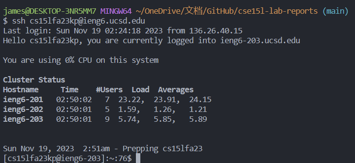
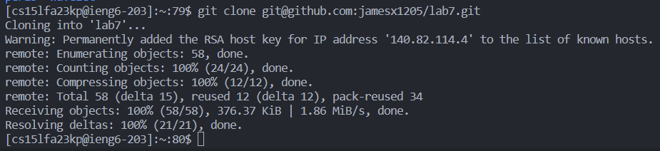
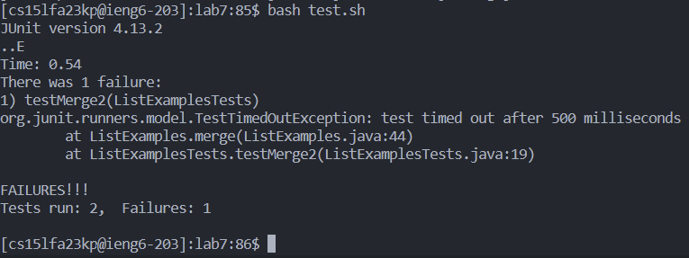
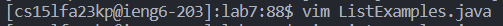
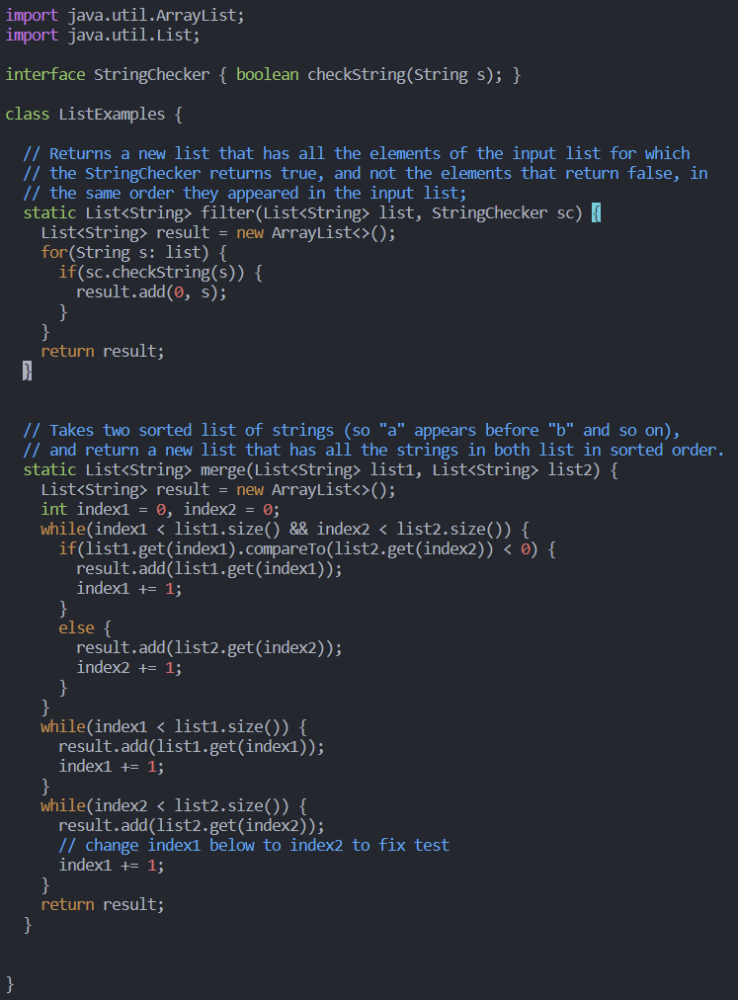
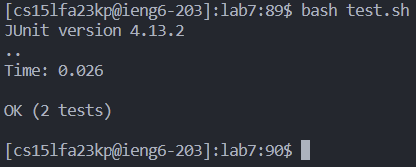
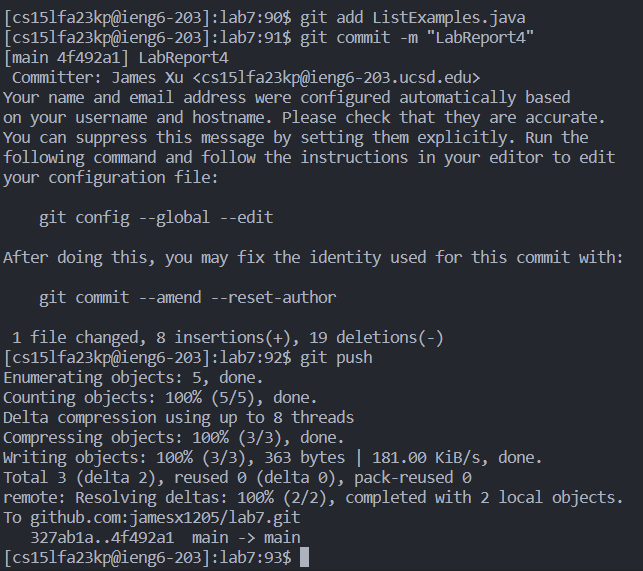

# Lab Report4 - Vim (Week 7)

## Step 4 - Log into ieng6

In this step, I used `ssh` to log into the remote server, and the account is `cs15lfa23kp@ieng6.ucsd.edu` for me. 

## Step 5 - Clone your fork of the repository from your GitHub account (using the SSH URL)

In this step, I clone the fork of the repository from my GitHub account using `git clone` with the address from `ssh` type fork. 

## Step 6 - Run the tests, demonstrating that they fail

In this step, I used `bash test.sh` to run the test. It shows one failure out of the two test runs; therefore, this is a failure.

## Step 7 - Edit the code file to fix the failing test

In this step, I used `vim ListExamples.java` to get into the file in the terminal using `vim`. Then:
> Keys pressed: <3><4><j><e><x><i><2><esc><:><w><q><enter>

The command was  34 lines down from the first line, so I did `34j` to go down to the line that has `index1 += 1;` 
and used `e` to go to the end of the word, which was `index1`. Then, I used `x` to delete the character under the cursor, which is `1`.
After that, I used `i` to go into insert mode. Then, type `2` to insert 2 before the cursor. Then, use `ese` to exit insert mode. 
Then I type `:wq` with `<enter>` to save and quit `vim`. Therefore, after the keypresses, we went into the file and changed `index1` to `index2.`
and saved the file. 

## Step 8 - Run the tests, demonstrating that they now succeed

By running `bash test.sh` I can run the test, and it showed that both tests passed.

## Step 9 - Commit and push the resulting change to your GitHub account (you can pick any commit message!)

In this step, I did `git add ListExamples.java ` to add the edited Java file into GitHub. Then I used `git commit -m "LabReport4"` to add
a commit and say `LabReport4`. Then, I used `git push` to push the file to GitHub. Therefore, after these steps, the file in now updated and in GitHub.
